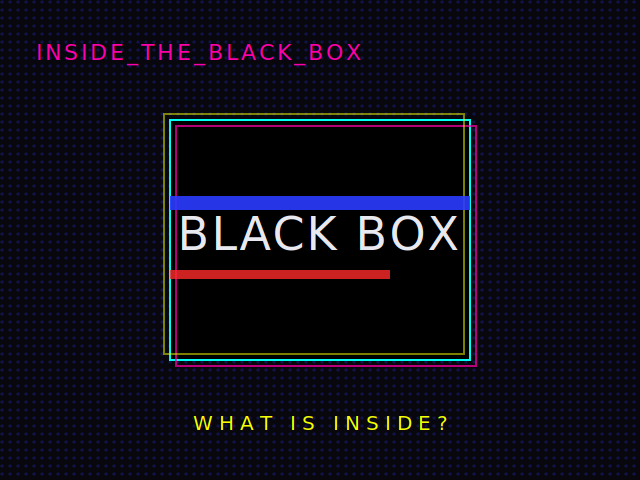

# INSIDE THE BLACK BOX

A dynamic, one-page **glitch / Y2K web-brutalism** presentation on Gilbert Simondon's
politics of technology (after Henning Schmidgen). It walks an audience from **chaos to
order** across four acts and ends with an AI chatbot — the *rationalizer*.



## Quick start

```bash
npm install
npm run dev      # vercel dev (page + /api functions)
```

No Vercel CLI yet? `npm i -g vercel`, then `vercel login`.

## Add your own content (no rebuild)

Drop images / gifs / videos / `.txt` files into numbered folders inside
`Slides_Datasets/`. The two-digit prefix sets the slide order:

```
Slides_Datasets/
  01_Intro/            ← images, gifs, videos, .txt
  02_Cybernetics_1951/
  03_Open_Machine/
  ...
```

`vercel dev` → reload to see changes instantly. In production, `git push` redeploys
and re-scans automatically. The chatbot reads the same content, so it always knows
what is on the canvas.

## Deploy

1. Push to GitHub, import into **Vercel** (preset: *Other*).
2. Set env var **`AI_GATEWAY_API_KEY`** (Vercel AI Gateway) for the live chatbot.
   Optional **`CHAT_MODEL`** (default `anthropic/claude-sonnet-4-6`).
3. Deploy. Without a key, the page still works; the chatbot shows a graceful fallback.

## Controls

`NEXT / BACK`, the on-screen buttons, **→ / Space / ←**, and dragging the windows on the
messy canvas. Full notes in [`CLAUDE.md`](./CLAUDE.md).
