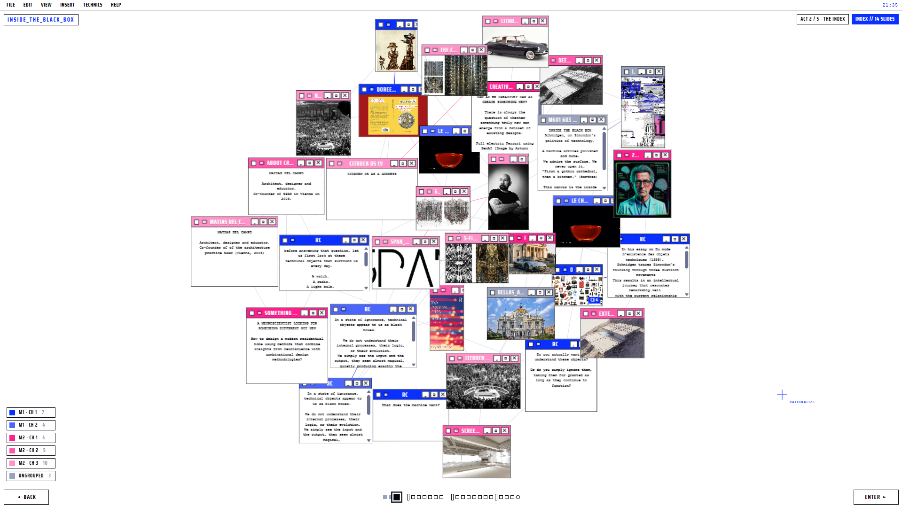

# INSIDE THE BLACK BOX

A dynamic, one-page presentation on Gilbert Simondon's **politics of technology**
(after Henning Schmidgen's essay *"Inside the Black Box"*). It moves an audience from
**chaos → order → calm** across five acts and ends with an AI chatbot — the *rationalizer*.

> The black box already scrambles the data. What matters is how **we** rationalize it.



## The five acts

1. **The Box** — a full-screen electric-blue title splash, then **The Team** (the four members'
   photos, square and blue-filtered, in window frames).
2. **The Index** — a force-directed graph of *every* item, mixed into one blob; hover isolates a
   group, click jumps into its mega-group.
3. **The Messy Canvas** — opens **one mega-group at a time**; each NEXT zooms the next slide up as
   a hero while earlier ones settle into an ordered grid.
4. **Rationalization** — all items assemble into one clean ordered grid (above), then the punch
   line emerges.
5. **The Rationalizer** — an AI chatbot, grounded in the live canvas + the source papers, on the
   calm Act-1 blue.

## Quick start

```bash
npm install

# Option A — quick visual preview, no login (static; chatbot shows offline fallback)
npm run snapshot      # refresh slides-data.js from your folders
npm run preview       # http://localhost:5050

# Option B — full local with live /api + AI chat
npm i -g vercel       # if needed
vercel dev            # run vercel dev DIRECTLY (not via `npm run dev`)
```

> Run `vercel dev` directly — there is intentionally no `npm run dev` script, because
> Vercel resolves its dev command to `npm run dev` and that would recurse into itself.
> If you rename/add folders while a preview server is running, **restart it** so the
> scanner reloads.

## Add your own content (no rebuild)

Each **folder = one slide**. Name folders **`MgNN_gNN_MM_Title`**:

```
Slides_Datasets/
  Mg01_g01_01_Intro/        ← mega-group 01, group 01, slide 01
  Mg01_g02_01_Open_Machine/ ← same mega-group, next chapter
  Mg02_g01_01_Creative_AI/  ← new mega-group
  ...
```

- **`MgNN`** = mega-group (super-chapter) · **`gNN`** = group/chapter inside it · **`MM`** = slide
  order · **`Title`** = the name. Order is **mega → group → slide**.
- **Colour follows the hierarchy:** each mega-group owns one hue (Mega 1 = blue, Mega 2 = pink, …)
  and each group inside it is a subtly lighter shade; every window shows a `G{n}` chip.
- Legacy `gNN_MM_Title` and `NN_Title` names still work (they sort after the mega-grouped ones).

Supported files: **images** (`.png .jpg .jpeg .webp .svg .avif .bmp`), **gifs** (`.gif`),
**videos** (`.mp4 .webm .mov .m4v .ogv`), **text** (`.txt .md`). Use URL-safe filenames (letters,
numbers, `-`, `_` — no spaces or parentheses), and **commit your assets** so they deploy.

### Automatic special panels (by folder contents)

- **Numbered image sequence → large viewer.** A folder with **≥2 images named just by number**
  (`01.png`, `02.png`, … `06.png`) becomes one big exclusive viewer: one frame at a time, advanced
  **only** by the bottom `‹ ›` arrows. Any text file in that folder shows smaller underneath.
- **Lone text file → statement / question.** A folder with **only one text file** opens as a large
  panel — a key statement, or (if it contains a `?`) a **question for the audience**.

`vercel dev` → reload to see changes instantly. In production, `git push` redeploys and re-scans
automatically. The chatbot reads the same content (plus the PDFs in `assets/PDF/`), so it always
knows what is on the canvas.

## Deploy

1. Push to GitHub, import into **Vercel** (preset: *Other* — `vercel.json` does the rest).
2. Set a chatbot key (either works): **`ANTHROPIC_API_KEY`** (a normal `sk-ant-…` key, talks to
   Anthropic directly) or **`AI_GATEWAY_API_KEY`** (Vercel AI Gateway). Optional **`CHAT_MODEL`**
   (default `anthropic/claude-haiku-4-5`). **Redeploy after changing env vars.**
3. Deploy. Without a key, the page still works; the chatbot shows a graceful fallback.

## Controls

`NEXT / BACK`, the on-screen buttons, **→ / Space / ←**, dragging windows on the messy canvas, and
the **progress bar** at the bottom — a compact, colour-coded map of the whole run where you can
**click any dot to jump** to that step. Full notes in [`CLAUDE.md`](./CLAUDE.md).
